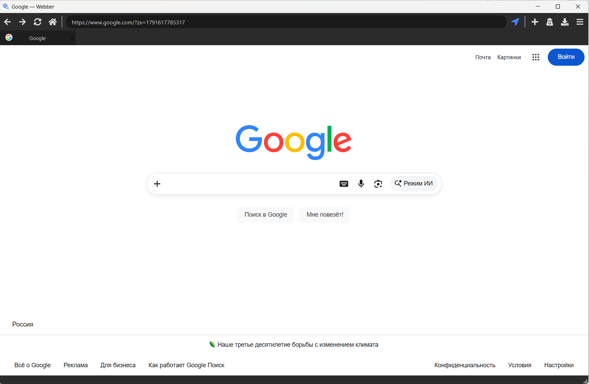
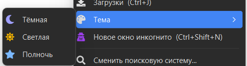
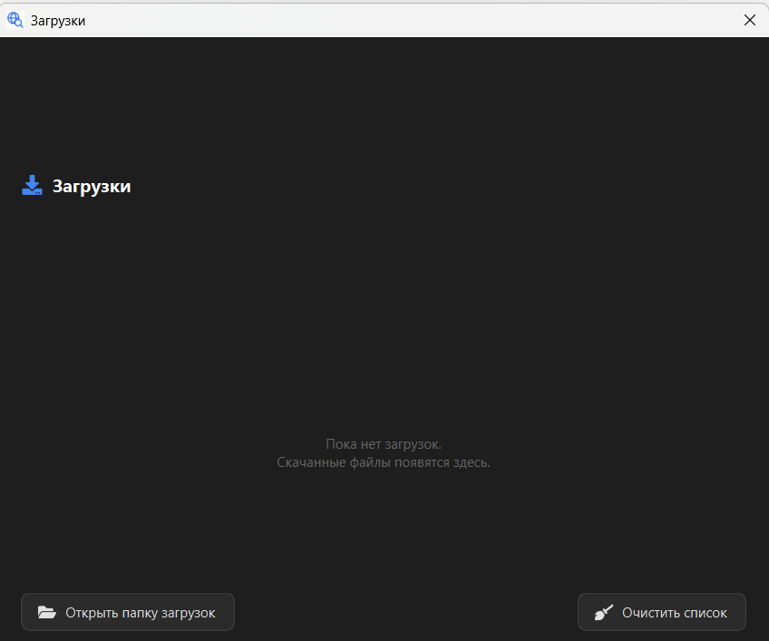

# Webber

**Быстрый и удобный браузер на PyQt6 + QtWebEngine.**

Современный движок Chromium 118+, тёмная/светлая/полночная темы, менеджер загрузок, режим инкогнито и аккуратный интерфейс с иконками Font Awesome.

<p align="center">
  
</p>

<p align="center">
  
  
  
  
  
</p>

<p align="center">
  <a href="https://github.com/ilabolAfk/Webber/stargazers">
    
  </a>
  <a href="https://github.com/ilabolAfk/Webber/issues">
    
  </a>
  <a href="https://github.com/ilabolAfk/Webber/commits/main">
    
  </a>
  <a href="https://github.com/ilabolAfk/Webber/blob/main/LICENSE">
    
  </a>
</p>

---

## Возможности

- **Современный движок** — QtWebEngine на Chromium 118+ (PyQt6). Google, GitHub, YouTube и другие сайты рендерятся как в настоящем Chrome.
- **Вкладки** — открытие, закрытие, перемещение, favicon сайта, отдельный крестик.
- **Поиск** — 5 поисковых систем на выбор (Google, DuckDuckGo, Bing, Brave, Яндекс) с индикатором приватности. Показывает, кто следит за вами, а кто нет.
- **Темы** — Тёмная, Светлая, Полночь. Переключается через меню, сохраняется между запусками.
- **Менеджер загрузок** — прогресс-бар, пауза/возобновление, отмена, открытие файла, показ в папке.
- **Режим инкогнито** — отдельное окно с off-the-record профилем: cookies, кэш и история **не** пишутся на диск.
- **Фоновые задачи** — сохранение конфига и открытие файлов работают в `QThreadPool`, UI не подвисает.
- **Иконки Font Awesome 5** через `qtawesome` — единый стиль интерфейса.
- **Собственная иконка `icon.ico`** — в таскбаре, заголовках окон и диалогах.
- **Горячие клавиши** — как в обычном браузере (см. ниже).

---

## Скриншоты

> Замени на свои скриншоты. Положи их в папку `screenshots/` в репозитории.

| Главное окно | Меню тем | Загрузки |
|:---:|:---:|:---:|
|  |  |  |

---

## Установка

### Требования

- **Python 3.10+** (тестировалось на 3.12)
- **Windows / Linux / macOS**

### Шаги

```bash
git clone https://github.com/ilabolAfk/Webber.git
cd Webber
pip install PyQt6 PyQt6-WebEngine qtawesome
python main.py
```

Всё. При первом запуске появится экран выбора поисковой системы.

---

## Горячие клавиши

| Клавиши | Действие |
|---|---|
| `Ctrl+T` | Новая вкладка |
| `Ctrl+W` | Закрыть вкладку |
| `Ctrl+L` | Фокус на адресную строку |
| `Ctrl+R` / `F5` | Обновить страницу |
| `Alt+←` / `Alt+→` | Назад / Вперёд |
| `Ctrl+J` | Открыть менеджер загрузок |
| `Ctrl+Shift+N` | Новое окно инкогнито |
| `Ctrl+Q` | Выход |

---

## Структура проекта

```
Webber/
├── main.py          # точка входа, загрузка конфига, применение темы
├── browser.py       # главное окно, вкладки, тулбар, меню
├── tabbar.py        # кастомный QTabBar с крестиком
├── dialogs.py       # экран выбора поисковой системы
├── downloads.py     # менеджер загрузок
├── themes.py        # 3 темы и генератор QSS
├── engines.py       # список поисковых систем
├── incognito.py     # off-the-record профиль
├── workers.py       # QThreadPool для фоновых задач
├── icon.ico         # иконка приложения
├── build.bat        # сборка exe (Windows)
├── LICENSE          # GPL-3.0
└── README.md
```

### Архитектура

- **UI-поток** — все виджеты, обработчики сигналов QtWebEngine (короткие).
- **Chromium-процессы** — рендеринг вкладок и загрузки (QtWebEngine управляет сам).
- **`QThreadPool`** — сохранение JSON-конфига и открытие файлов (через `workers.py`).
- **Конфиг** — `~/.webber_config.json` (тема, поисковик, папка загрузок).

---

## Сборка в `.exe` (Windows)

### Быстрый способ

1. Положи `icon.ico` в корень проекта.
2. Дважды кликни `build.bat`.
3. Готовый `.exe` появится в `dist\Webber\Webber.exe`.

### Что делает `build.bat`

- Очищает `build/`, `dist/`, `.spec`.
- Запускает PyInstaller в режиме `--onedir` (**обязательно** для QtWebEngine — иначе Chromium не запустится).
- Подтягивает QtWebEngine (Chromium, ICU, `QtWebEngineProcess.exe`) и шрифты Font Awesome.
- Копирует `icon.ico` внутрь сборки.
- Исключает тяжёлые пакеты (`torch`, `numpy`, `matplotlib` и др.) — экономит ~300 МБ.

**Размер сборки:** ~250–350 МБ (внутри полный Chromium — так же, как в Chrome).

### Запуск без консоли

`build.bat` использует `--windowed`, поэтому у пользователя не будет чёрного окна `cmd` за браузером.

---

## Приватность

- **Обычный режим** — Webber сохраняет cookies и localStorage через стандартный профиль QtWebEngine (`~/.local/share/...` или `%APPDATA%`). Слежка зависит только от **выбранной вами поисковой системы** — Webber показывает статус в нижней панели.
- **Инкогнито** — `QWebEngineProfile()` без имени (off-the-record). Cookies, кэш и история **не пишутся на диск**. Закрыли окно → всё исчезло.
- **Webber не отправляет** никакие данные о вас куда-либо. Никакой телеметрии.

---

## Известные ограничения

- **QtWebEngine 6.11 = Chromium 118.** Некоторые самые свежие CSS-фичи (например, `@scope`) могут не работать. Для 99 % сайтов этого достаточно.
- **Windows Defender** может ругаться на собранный `.exe` — это ложное срабатывание эвристики PyInstaller. Решение: добавить папку в исключения.
- **Скачивание в инкогнито** сохраняется в обычную папку `~/Downloads` — это ожидаемое поведение (как и в Chrome).

---

## Разработка

### Запуск из исходников

```bash
python main.py
```

### Изменение списка поисковых систем

Правь `engines.py` — добавь словарь с полями `id`, `name`, `url`, `home`, `icon`, `icon_color`, `desc`, `tracking`, `tracking_note`.

### Добавление темы

В `themes.py` добавь словарь в `THEMES` с полями `name`, `icon`, `icon_color`, `colors`. Меню подхватит автоматически.

### Стек

- **PyQt6** (6.11) — UI-фреймворк
- **PyQt6-WebEngine** (6.11) — Chromium 118
- **qtawesome** (1.4) — Font Awesome 5 иконки

---

## Лицензия

**GNU General Public License v3.0 (GPL-3.0)**

Copyright © 2026 ilabolAfk

Это свободное программное обеспечение: вы можете распространять и/или изменять его на условиях GNU General Public License, опубликованной Free Software Foundation — либо версии 3, либо (по вашему выбору) любой более поздней версии.

Webber распространяется в надежде, что он будет полезен, но **без каких-либо гарантий** — даже без подразумеваемой гарантии товарной пригодности или пригодности для конкретной цели. Подробности см. в GNU General Public License.

Полный текст лицензии: [LICENSE](LICENSE) или <https://www.gnu.org/licenses/gpl-3.0.html>.

### Что это значит на практике

- ✅ Можно свободно **использовать**, **изучать**, **изменять** и **распространять** Webber.
- ✅ Можно создавать форки и публиковать их — при условии, что производные работы также будут под GPL-3.0.
- ⚠️ **Нельзя** делать закрытые проприетарные форки — весь код производных должен остаться открытым под GPL-3.0.
- ⚠️ При распространении `.exe` или исходников нужно приложить текст лицензии и указать авторство оригинала.
- ⚠️ **Никаких гарантий** — автор не несёт ответственности за любой ущерб.

> **Примечание.** Qt6 и QtWebEngine распространяются под LGPLv3/GPLv3, `qtawesome` — под MIT, Font Awesome Free — под CC BY 4.0 (иконки) и SIL OFL 1.1 (шрифты). Все зависимости Webber совместимы с GPL-3.0.

---

## Ссылки

- **GitHub:** [github.com/ilabolAfk/Webber](https://github.com/ilabolAfk/Webber)
- **Issues:** [github.com/ilabolAfk/Webber/issues](https://github.com/ilabolAfk/Webber/issues)
- **Releases:** [github.com/ilabolAfk/Webber/releases](https://github.com/ilabolAfk/Webber/releases)

---

<p align="center">
  Сделано с ♥ на PyQt6 · Распространяется под <a href="LICENSE">GPL-3.0</a>
</p>
